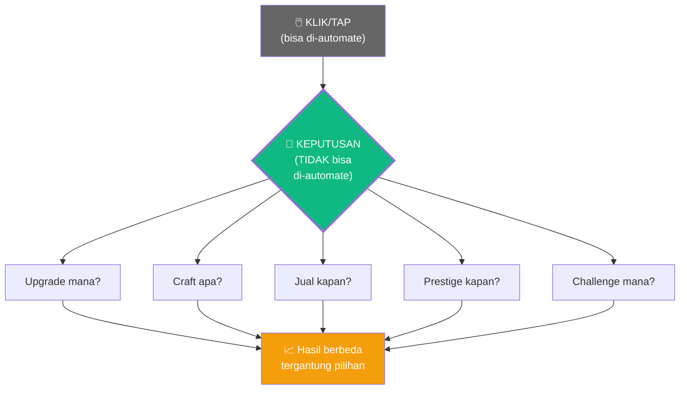

# 🎯 "Strategi" dalam Game Idle — Penjelasan Konkret

## Jawaban Singkat

**YA, persis seperti itu.** Game akan menampilkan **pilihan-pilihan** di mana pemain harus **pikir dulu** sebelum memilih. Tidak ada jawaban yang selalu benar — tergantung situasi.

Bedanya dengan klik biasa:
- **Klik biasa** → otak mati, jari gerak, auto-clicker bisa gantiin
- **Strategi** → otak harus mikir, auto-clicker tidak bisa memilih

---

## 5 Momen "Strategi" Konkret yang Akan Dilihat Pemain

---

### Momen 1: "Upgrade Mana Dulu?" 🤔

Pemain punya **530 coin**. Di layar muncul pilihan:


```
╔══════════════════════════════════════════════════╗
║  💰 Koin kamu: 530                               ║
║                                                  ║
║  ┌─────────────────┐  ┌─────────────────┐       ║
║  │ ⛏️ Auto-Miner    │  │ 🔨 Better Anvil  │       ║
║  │ Level 3 → 4     │  │ Level 1 → 2     │       ║
║  │                 │  │                 │       ║
║  │ +10 ore/detik   │  │ Craft 50% lebih │       ║
║  │                 │  │ cepat           │       ║
║  │ Harga: 500 💰   │  │ Harga: 500 💰   │       ║
║  └─────────────────┘  └─────────────────┘       ║
║                                                  ║
║  ⚠️ Kamu cuma bisa pilih SATU!                   ║
╚══════════════════════════════════════════════════╝
```

**Dilema pemain:**
- Auto-Miner → dapat ore **lebih banyak** tapi craft masih lambat
- Better Anvil → craft **lebih cepat** tapi ore masih sedikit

**Tidak ada jawaban "benar"!** Tergantung:
- Kalau ore kamu sering penuh → pilih Anvil (proses lebih cepat)
- Kalau ore kamu sering kosong → pilih Miner (produksi lebih banyak)

🤖 **Auto-clicker tidak bisa memilih ini.**

---

### Momen 2: "Craft Apa dengan Material Terbatas?" 🔨

```
╔══════════════════════════════════════════════════╗
║  📦 INVENTORY:  🪨 x8   🔩 x4   💎 x2          ║
║                                                  ║
║  Kamu bisa craft SALAH SATU:                    ║
║                                                  ║
║  ┌──────────────────────────────────────┐       ║
║  │ A) ⚔️ Pedang Besi x2                 │       ║
║  │    Bahan: 🪨x4 🔩x2 (sisa material)  │       ║
║  │    Jual: 50π per pedang = 100π total │       ║
║  │    ⏱️ Waktu craft: 1 menit           │       ║
║  ├──────────────────────────────────────┤       ║
║  │ B) 👑 Mahkota Emas x1                │       ║
║  │    Bahan: 🪨x8 🔩x4 💎x2 (HABIS!)    │       ║
║  │    Jual: 500π                        │       ║
║  │    ⏱️ Waktu craft: 10 menit          │       ║
║  ├──────────────────────────────────────┤       ║
║  │ C) 🛡️ Perisai + ⚔️ Pedang            │       ║
║  │    Bahan: 🪨x6 🔩x3 💎x1             │       ║
║  │    Jual: 120π + 50π = 170π           │       ║
║  │    ⏱️ Waktu craft: 5 menit           │       ║
║  └──────────────────────────────────────┘       ║
╚══════════════════════════════════════════════════╝
```

**Dilema pemain:**
| Pilihan | Hasil | Kelebihan | Kekurangan |
|---------|-------|-----------|------------|
| A) 2x Pedang | 100π dalam 1 menit | Cepat, sisa material untuk craft lagi | Untung kecil |
| B) 1x Mahkota | 500π dalam 10 menit | Untung besar! | Material habis, harus nunggu 10 menit |
| C) Perisai+Pedang | 170π dalam 5 menit | Seimbang | Tidak maksimal di kedua arah |

**Dan ada faktor tambahan:**
- Harga di market **berubah-ubah**! Mungkin 1 jam lagi pedang naik jadi 80π
- Kalau ada Daily Challenge "Craft 3 Mahkota" → pilihan B jadi lebih worth it
- Kalau kamu mau offline 8 jam → pilih B karena nanti tinggal klaim hasilnya

🤖 **Auto-clicker tidak bisa menghitung ini.**

---

### Momen 3: "Jual Sekarang atau Tunggu?" 📈

```
╔══════════════════════════════════════════════════╗
║  🏪 MARKET — Harga berubah setiap 30 menit      ║
║                                                  ║
║  📊 HARGA SAAT INI:                             ║
║                                                  ║
║  ⚔️ Pedang:  35π  ↓↓ (turun dari 50π!)          ║
║  🛡️ Perisai: 150π ↑↑ (naik dari 80π!)           ║
║  👑 Mahkota: 450π  → (stabil)                    ║
║                                                  ║
║  📦 Inventory kamu: ⚔️x5  🛡️x2  👑x1            ║
║                                                  ║
║  ┌──────────────────────────────────┐            ║
║  │  Jual semua sekarang?            │            ║
║  │  ⚔️x5 = 175π                     │            ║
║  │  🛡️x2 = 300π  ← harga lagi NAIK!│            ║
║  │  👑x1 = 450π                     │            ║
║  │  TOTAL: 925π                     │            ║
║  │                                  │            ║
║  │  [JUAL SEMUA]  [JUAL SEBAGIAN]  │            ║
║  │  [TAHAN DULU]                    │            ║
║  └──────────────────────────────────┘            ║
╚══════════════════════════════════════════════════╝
```

**Dilema pemain:**
- Perisai harga lagi **naik** — tahan dulu, mungkin naik lagi?
- Pedang harga lagi **turun** — jual sekarang sebelum makin turun?
- Atau tahan semua dan craft lebih banyak dulu?

🤖 **Auto-clicker tidak bisa analisis tren harga.**

---

### Momen 4: "Prestige Sekarang atau Nanti?" ⭐

```
╔══════════════════════════════════════════════════╗
║  ⭐ PRESTIGE TERSEDIA!                           ║
║                                                  ║
║  Progress saat ini: 1,200,000 coins              ║
║                                                  ║
║  Kalau PRESTIGE sekarang:                        ║
║  → Dapat 3 Prestige Stars ⭐⭐⭐                  ║
║  → Permanent boost: +30% semua income            ║
║  → RESET semua progress ke 0                     ║
║                                                  ║
║  Kalau TUNGGU sampai 5,000,000:                  ║
║  → Dapat 8 Prestige Stars ⭐⭐⭐⭐⭐⭐⭐⭐            ║
║  → Permanent boost: +80% semua income            ║
║  → Tapi butuh 3 hari lagi grinding...            ║
║                                                  ║
║  [PRESTIGE SEKARANG]    [TUNGGU DULU]            ║
╚══════════════════════════════════════════════════╝
```

**Dilema pemain:**
- Prestige sekarang = mulai dari 0 tapi dengan **+30% boost**, progress lebih cepat
- Tunggu 3 hari = boost lebih besar (**+80%**), tapi 3 hari itu bisa dipakai untuk 2x prestige kecil

**Jawaban optimal tergantung matematika dan gaya main masing-masing!**

🤖 **Auto-clicker tidak bisa mempertimbangkan ini.**

---

### Momen 5: "Pilih Daily Challenge Mana?" 📅

```
╔══════════════════════════════════════════════════╗
║  📅 DAILY CHALLENGES — Pilih 1 dari 3           ║
║                                                  ║
║  ┌────────────────────────────────────┐          ║
║  │ 🟢 EASY: Craft 10 Pedang           │          ║
║  │ Reward: 200π + 50 XP               │          ║
║  │ Deadline: 24 jam                   │          ║
║  ├────────────────────────────────────┤          ║
║  │ 🟡 MEDIUM: Jual item senilai 2000π │          ║
║  │ Reward: 500π + Rare Blueprint 🗺️   │          ║
║  │ Deadline: 24 jam                   │          ║
║  ├────────────────────────────────────┤          ║
║  │ 🔴 HARD: Craft 1 Legendary Item    │          ║
║  │ Reward: 2000π + Exclusive Skin ✨   │          ║
║  │ Deadline: 24 jam                   │          ║
║  └────────────────────────────────────┘          ║
║                                                  ║
║  ⚠️ Gagal = tidak ada reward!                    ║
╚══════════════════════════════════════════════════╝
```

**Dilema pemain:**
- Pilih Easy → pasti dapat reward, tapi kecil
- Pilih Hard → reward BESAR, tapi kalau gagal = **0**
- Tergantung workshop level & material yang kamu punya hari ini

🤖 **Auto-clicker tidak bisa menilai kemampuan sendiri.**

---

## Ringkasan: Strategi = Pilihan Bermakna



> [!IMPORTANT]
> **"Strategi" = game menampilkan 2-3 pilihan → pemain harus PIKIR mana yang terbaik → setiap pilihan punya konsekuensi berbeda → tidak ada jawaban yang selalu benar.**
>
> Ini yang membuat game:
> - ✅ **Tidak membosankan** — selalu ada keputusan baru
> - ✅ **Anti auto-clicker** — bot tidak bisa memilih strategi
> - ✅ **Replayable** — setiap pemain bisa punya strategi berbeda
> - ✅ **Sosial** — "strategi kamu apa?" jadi bahan diskusi
